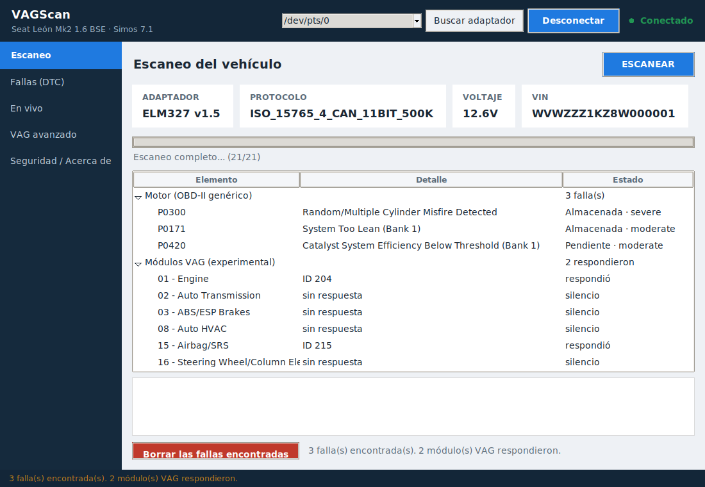
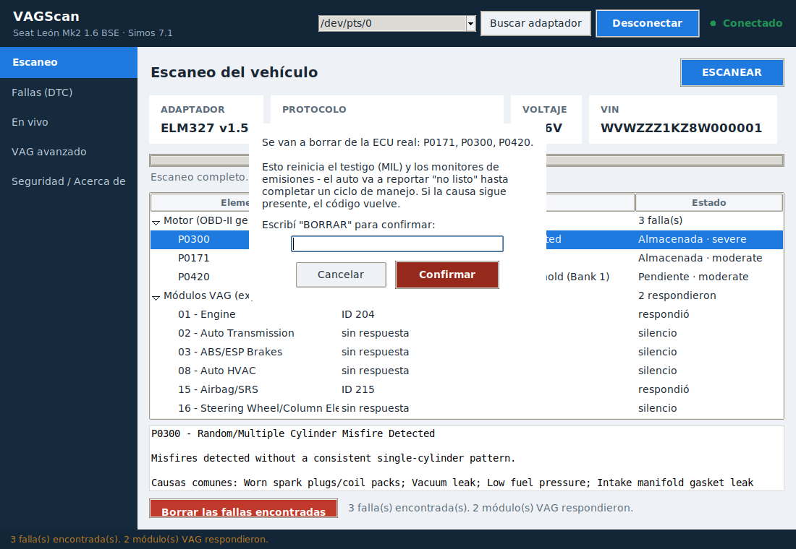
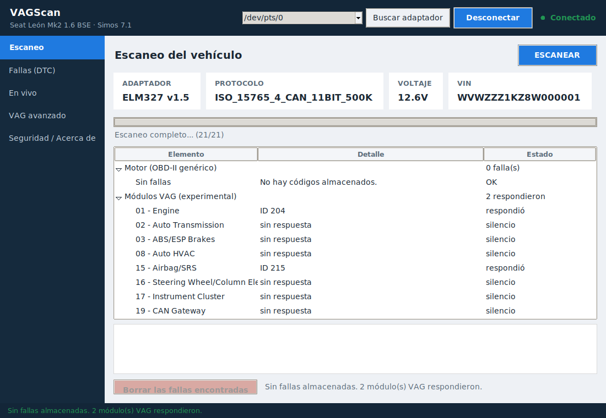
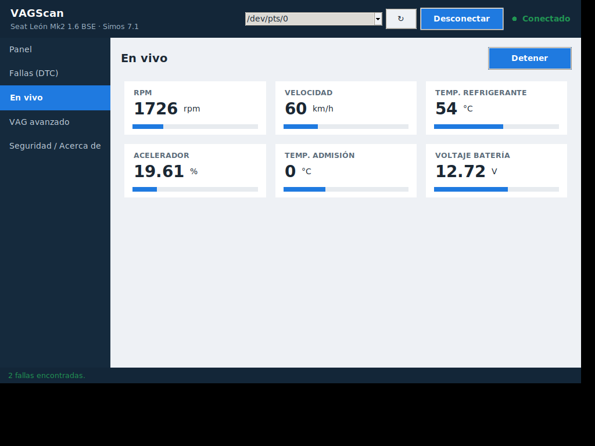
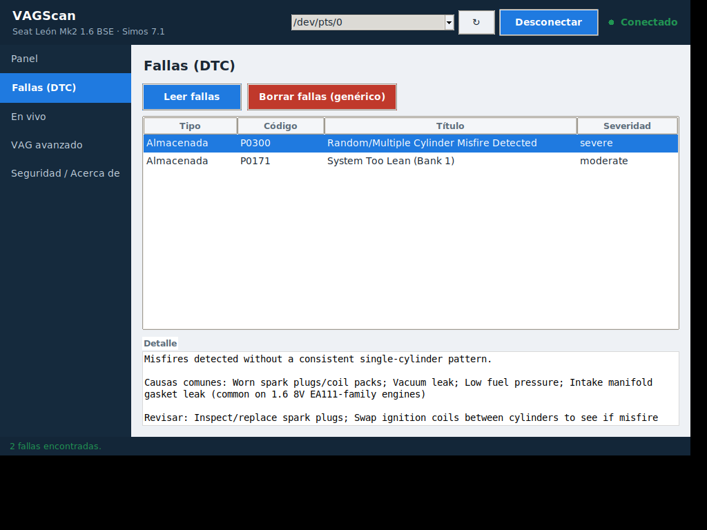
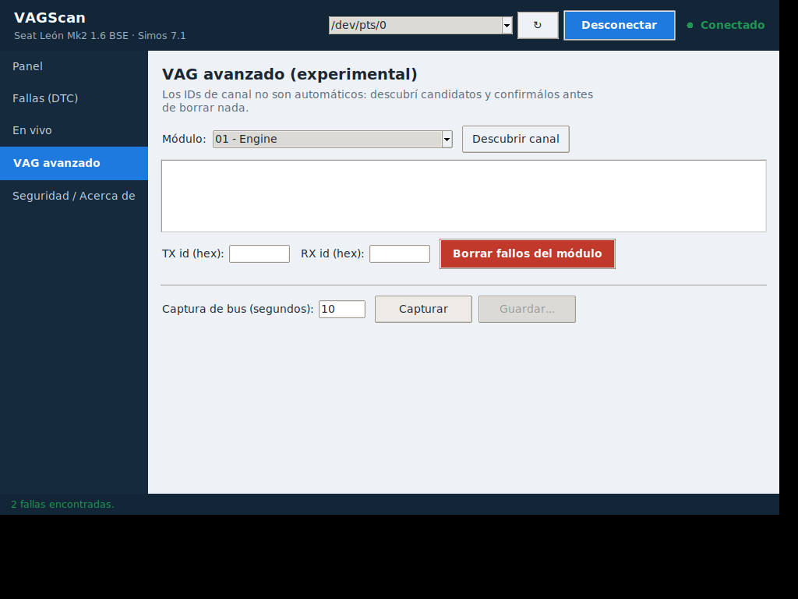

# vagscan

OBD-II + VAG (KWP2000/TP2.0) diagnostic scanner over an ELM327 Bluetooth
adapter, built and tuned for a **Seat Leon Mk2 (1P) 1.6 BSE** (Simos 7.1
ECU) but the generic OBD-II layer works on any OBD-II-compliant vehicle.

Connects from a PC over a paired Bluetooth serial port (shows up as a COM
port on Windows, `/dev/rfcomm*` on Linux once paired at the OS level). A
mobile front-end can reuse this same package later - it was split into
transport / driver / service layers specifically so the protocol logic
isn't tied to the CLI.

## What actually works today

- **Generic OBD-II (`vagscan.obd2`)**: Mode 01 live data (RPM, speed,
  coolant/intake temp, fuel trims, MAF, throttle, etc.), Mode 03/07/0A
  (stored/pending/permanent DTCs), Mode 04 (clear DTCs), Mode 09 (VIN).
  This is standard, well-tested, works on this car and any other OBD-II
  vehicle.
- **DTC knowledge base (`vagscan.dtc_db`)**: generic SAE J2012 code
  descriptions/causes/checks, plus a small set of VAG-specific *guidance*
  entries (airbag/SRS, ABS, instrument cluster, comfort system). See the
  `_meta` note in `dtc_db/data/vag_codes.json` - the VAG entries are
  engineering guidance, not a recitation of VAG's internal fault-code
  catalog, and are meant to be filled in with confirmed codes as you scan
  this specific car.
- **Desktop GUI (`vagscan.gui`)**: the friendly front end and what most
  people should run. Auto-detects the adapter, one **ESCANEAR** button that
  sweeps the whole car, results with descriptions/causes/checks, live
  gauges, and clearing that acts on the real ECU behind a
  confirmation-phrase gate - see below.
- **Adapter auto-detection (`vagscan.transport.discovery`)**: probes each
  serial port (including `/dev/rfcomm*`, which some distros don't
  enumerate) and identifies the one that answers as an ELM327, instead of
  making you guess which COM port it landed on.
- **Full scan (`vagscan.app.full_scan`)**: one pass over generic OBD-II
  plus every known VAG module address, reporting partial results - a silent
  module or an unsupported mode is a normal outcome, not an aborted scan.
- **Odometer read (`vagscan.gui` "Kilometraje" tab)**: reads the mileage
  stored in the instrument cluster so it can be seen and documented (e.g.
  before a legitimate cluster swap). **Read-only, by design.** Writing a
  stored odometer is fraud and is not implemented - there is no code path
  that does it, and a test asserts that stays true. Reading goes through
  the experimental VAG layer, so on an adapter without monitor mode the
  safety interlock will decline rather than transmit blind.
- **CLI (`vagscan.app.cli`)**: the same functionality as a scriptable
  terminal tool - `ports`, `identify`, `live`, `dtc-read`, `dtc-clear`,
  `vin`, `vag-modules`, `vag-discover`, `vag-log`, `vag-clear`.

## What's experimental (`vagscan.vag`) and why

Simos 7.1 speaks VAG's proprietary KWP2000-over-CAN transport (TP2.0) for
anything beyond the OBD-II-mandated part of its behavior, and the ELM327
chipset has no built-in support for it - it only implements the standard
ISO 15765-4 OBD transport. `vagscan.vag` implements TP2.0 channel setup and
KWP2000 messaging on top of the ELM327's raw-CAN pass-through mode
(`ATSH`/`ATCAF0`/`ATMA`), because that's the only way to reach it at all
with this hardware.

**The exact byte-level details (channel-setup frame layout, resulting CAN
IDs, multi-frame segmentation) are an informed best guess from public
hobbyist reverse-engineering write-ups, not a spec anyone here can check
against.** `vag-discover` and `vag-log` exist specifically to validate (or
correct) those constants against *this* car before you trust anything
beyond read-only use - see the docstrings in `tp20.py` and `kwp2000.py` for
exactly what's uncertain and where to fix it once you have a real capture.

Out of scope, deliberately: no immobilizer bypass, no security-access
seed-to-key algorithm. `security_access_*` in `kwp2000.py` is a bare
request/response mechanism you can plug a manufacturer-documented
procedure into for your own vehicle - nothing is hardcoded or guessed here.

## What this actually puts on the car's bus

Audited by tracing every code path that can reach the vehicle, and verified
against an emulator by logging the wire. `AT*` commands configure the
adapter locally and never reach the bus; only these five things do:

| Traffic | Kind | Risk |
|---|---|---|
| `01xx` (Mode 01) | standard read | none - what every scan tool sends |
| `03` / `07` / `0A` | standard read | none |
| `0902` (VIN) | standard read | none |
| `04` (clear DTCs) | standard **write** | reversible; resets MIL + readiness monitors. Gated behind a typed confirmation phrase |
| TP2.0 probe frame | **non-standard** | the only real question mark - see below |

A default scan is **only** the standard reads. The VAG module sweep is a
checkbox that starts unchecked.

Volume is a non-issue: a full module sweep is one 8-byte frame per module,
~17 frames spread over ~17 seconds, against a bus that normally carries
thousands of frames per second. There is no path in this code that can
flood the bus.

**Listen before transmit.** The TP2.0 probe transmits on CAN ID 0x200
because that is what public reverse-engineering says the diagnostic
channel-setup broadcast is - not something anyone here can verify against a
spec. If that's wrong for a given car and 0x200 actually carries a module's
real traffic, transmitting would put a second sender on an ID a real
receiver is consuming. So `TP20Client` passively monitors the bus first and
**refuses to transmit** on an ID already in use, aborting the sweep with one
explanation. Verified against a simulated car with 0x200 occupied: zero
probe frames went out.

**Security access (KWP2000 service 0x27) is the one operation here that
could leave a module worse than it started** - wrong keys increment a
lockout counter. Nothing in the app or the CLI calls it, and it now refuses
to run without an explicit `i_understand_lockout_risk=True` from your own
code. There is no flashing, no coding, no adaptation writing, and no
immobilizer code anywhere in this project.

## About the cheap blue "ELM327 mini" clones

These (the ~$8 blue dongle labelled *ELM327 MINI - Supports all OBDII
protocols*) are what most people have, and they're fine for the standard
OBD-II side of this tool. Things worth knowing:

- **They are clones.** Genuine ELM327 silicon comes from ELM Electronics;
  these don't. `ATI` reports a version string that is often simply untrue,
  which is why the app shows it as "what the adapter *says* it is".
  Counter-intuitively the ones labelled **v1.5 are usually better** than the
  ones labelled v2.1.
- **They implement the standard OBD modes properly** - reading and clearing
  engine fault codes, live data. That's the part you'll actually use.
- **They're hit and miss on the optional AT commands**, and an unimplemented
  one just answers `?` rather than saying so. `ATMA` (monitor mode),
  `ATCAF0` and `ATCRA` are commonly missing. The app probes for these and
  tells you what yours supports instead of assuming.
- **Without working monitor mode the VAG probe stays disabled** - not as a
  limitation but as the safety interlock doing its job: it can't confirm the
  CAN ID is free, so it won't transmit. Standard OBD-II is unaffected.
- **Multi-frame responses (like the VIN) often fail** on these. Harmless -
  the VIN is informational and a failure there never aborts a scan.
- **Unplug it when you're not using it.** These draw current continuously
  and don't sleep properly; left plugged into the OBD port they can flatten
  a battery over a week or two. That's a property of the hardware, not of
  this software.
- Bluetooth pairing PIN is usually **1234** or **0000**.

### "I paired it but the app doesn't find it"

Pairing in Windows is not enough on its own - Windows exposes a Bluetooth
serial adapter as a **COM port**, and the app talks to that port. If
auto-detect finds nothing:

1. **Plug the ELM327 into the car's OBD socket with the ignition on.** A
   bare Bluetooth dongle has no power on the bench, so Windows can pair with
   its stored profile but can't actually open a connection - it only
   connects for real once the adapter is powered.
2. **Check the COM port exists**: Settings → Bluetooth & devices → More
   Bluetooth settings → **COM Ports** tab. There should be an *Outgoing*
   port for the adapter (e.g. COM5). If there isn't, remove the device and
   pair it again with the adapter powered.
3. Auto-detect probes every COM port at 38400, 9600, 115200 and 500000
   baud (clones vary), so you don't need to know which. If it still doesn't
   catch it, the port is listed in the dropdown - pick it by hand and hit
   Conectar.

You never need to understand COM ports to use the app - when auto-detect
works it connects on its own. The COM port only matters when it doesn't,
and the app now tells you which ports it saw so you know whether Windows
even created one.

## Safety notes

- Clearing a DTC (generic `dtc-clear` or `vag-clear`) resets the MIL and
  readiness monitors; the car reports emissions "not ready" until a full
  drive cycle completes. Both commands require typing an exact
  confirmation phrase - there's no `--yes` flag.
- Clearing the **airbag/SRS module (address 15)** requires typing a
  separate, longer confirmation phrase. Clearing a fault code there does
  not fix whatever tripped it; if the underlying issue (e.g. a squib
  circuit fault) is still present, the airbag system may not deploy
  correctly in a real collision. Never probe a pyrotechnic squib circuit
  with a generic multimeter.
- The final call on any reading is yours (the human at the keyboard) - this
  tool surfaces data, it doesn't make diagnostic decisions.

## How you actually use it

1. Plug the ELM327 into the car's OBD port, ignition on.
2. Pair it once in the OS's Bluetooth settings (it becomes a COM port /
   `/dev/rfcommN`).
3. Open the app. It probes the serial ports on startup and connects to
   whichever one answers like an ELM327 - you don't pick a port by hand
   (there's a "Buscar adaptador" button to redo it, and the dropdown is
   still there as a manual override).
4. Hit **ESCANEAR**. It reads the engine over generic OBD-II
   (stored/pending/permanent codes + VIN) and then asks each known VAG
   module address whether it's there, with a progress bar the whole way.
5. Results come back in one tree: every code with its description, likely
   causes and what to check, plus which modules answered.
6. **Borrar las fallas encontradas** clears them on the real ECU (OBD-II
   Mode 04) after you type the confirmation phrase, then re-scans
   automatically so you can see what actually cleared and what came back.

## Screenshots (GUI)

| Escaneo completo | Confirmación antes de borrar |
|---|---|
|  |  |

| Después de borrar | En vivo |
|---|---|
|  |  |

| Fallas (detalle) | VAG avanzado |
|---|---|
|  |  |

These were taken against a scripted ELM327 emulator (no car needed to see
the UI work) - see the "Tests" section below for how that emulator works.

## Install (download the app)

You don't need Python or any of this source code to use it.

**[⬇ Descargar VAGScan.exe](https://github.com/cquiroga-arch/leontest-01/releases/latest/download/VAGScan.exe)**
— one file, double-click it, nothing to install.
([Linux build](https://github.com/cquiroga-arch/leontest-01/releases/latest/download/VAGScan),
[all releases](https://github.com/cquiroga-arch/leontest-01/releases/latest))

Windows SmartScreen will warn about an unrecognised app the first time,
because the executable isn't code-signed (signing certificates cost money
and this is a personal tool). *More info → Run anyway.*

If something looks wrong, run `VAGScan.exe --selftest` - it checks the app
is intact and lists the serial ports it can see, without needing a car.

Every build runs the test suite first and then verifies the produced
executable actually starts and has its full fault-code database, so a
broken download shouldn't reach you in the first place.

## Run from source instead

```bash
python3 -m venv .venv
source .venv/bin/activate  # or .venv\Scripts\activate on Windows
pip install -e ".[dev]"
vagscan-gui
```

To build the standalone executable yourself:

```bash
pip install pyinstaller
pyinstaller --clean --noconfirm packaging/vagscan.spec
python packaging/verify_build.py dist/VAGScan      # dist/VAGScan.exe on Windows
```

Tkinter (the GUI toolkit) ships with the official python.org installers for
Windows/macOS, so most people already have it. On Linux, if `vagscan-gui`
complains it's missing, install your distro's package first (Debian/Ubuntu:
`sudo apt install python3-tk`).

Pair the ELM327 at the OS level first (Windows Settings > Bluetooth &
devices, or `bluetoothctl` on Linux) - it'll show up as a serial/COM port.
Then either:

```bash
vagscan-gui                       # the desktop app - pick the port from the dropdown and hit Conectar
```

or, for scripting/automation, the CLI:

```bash
vagscan ports                     # find the paired adapter's serial port
vagscan --port COM5 identify      # or /dev/rfcomm0 on Linux
vagscan --port COM5 live --pids 0C,0D,05
vagscan --port COM5 dtc-read --pending --permanent
vagscan --port COM5 vag-modules
vagscan --port COM5 vag-log --seconds 30 --out capture.log
```

## Tests

```bash
pytest
```

80 tests run against an in-memory fake transport (`tests/conftest.py`) - no
hardware required. They validate our own protocol/framing logic (driver AT
sequencing, OBD2 PID/DTC decoding, TP2.0 single-frame send/receive, KWP2000
positive/negative response handling, the odometer read + decode, the
listen-before-transmit interlock, the GUI's background IOWorker), not the
real ECU's behavior, which can only be confirmed against the actual car.

### Try it with no car (software ELM327 + car)

`tools/car_emulator.py` is a full software adapter+vehicle: an engine
idling with RPM jitter, coolant warming up, a running-engine battery
voltage reported both ways (ATRV and PID 0142), stored DTCs and a VIN, with
live values that move over time. By default it emulates the common blue
"ELM327 v1.5 mini" clone (no monitor mode), so you can see the whole app
behave - including the VAG/odometer path declining safely - exactly as it
will on that hardware. `--genuine` emulates a monitor-capable adapter.

```bash
python tools/car_emulator.py            # prints a PTY path
# then point VAGScan at that path (Linux: symlink it to /dev/rfcomm0 so
# auto-detection finds it), connect, and scan
```

The GUI was driven end-to-end against this emulator - auto-detect, connect,
scan, stream live data (RPM ~820, battery ~14.1 V), and the odometer tab
declining on the clone - which is how the screenshots were produced. Note
the two battery readings differ by a few tenths on purpose: ATRV is the
adapter's own voltage pin, PID 0142 is the ECU's measured supply - both are
real, independent readings, not a discrepancy.
